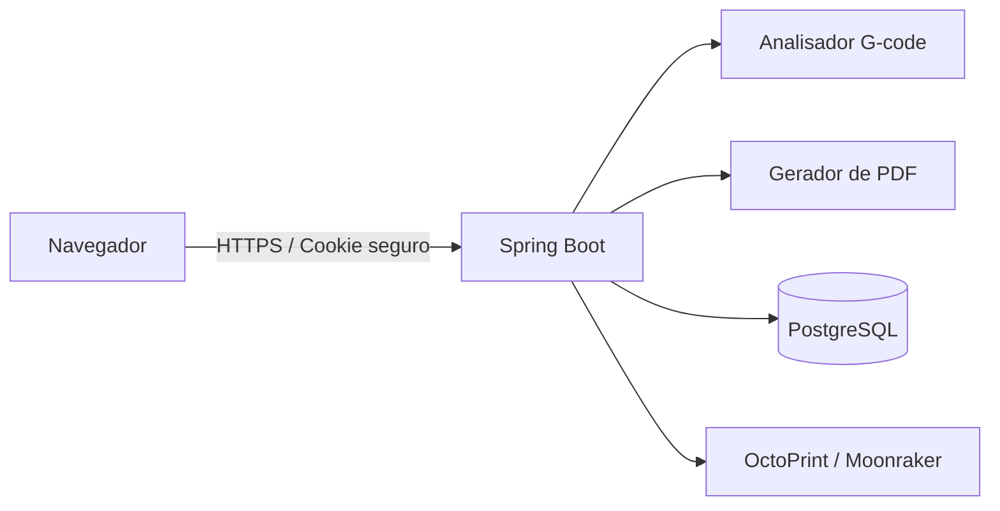

<div align="center">
  

  # RAVI MAKERS · Orçamento 3D

  **Gestão e precificação de impressão 3D a partir de arquivos G-code.**

  [](https://openjdk.org/)
  [](https://spring.io/projects/spring-boot)
  [](https://www.postgresql.org/)
  [](https://www.docker.com/)
  [](#qualidade-e-segurança)
</div>

## Sobre o projeto

O RAVI MAKERS centraliza o fluxo operacional de uma pequena empresa de impressão 3D. A aplicação analisa metadados de arquivos G-code, calcula custos de produção, controla estoque e transforma o resultado em orçamentos profissionais.

O projeto foi construído como uma aplicação web completa, com frontend responsivo em Thymeleaf e JavaScript, API Spring Boot, autenticação segura e persistência PostgreSQL.

## Funcionalidades

- análise de arquivos `.gcode`, `.gco` e `.gc` de até 100 MB;
- detecção de tempo, consumo de filamento, material, cor, perfil e impressora;
- cálculo de material, energia, máquina, manutenção, perdas e margem;
- orçamentos com múltiplas placas e filamentos;
- geração de PDF para o cliente;
- cadastro de clientes, impressoras, filamentos e consumíveis;
- baixa automática e histórico de movimentações do estoque;
- acompanhamento de produção;
- integração com OctoPrint e Moonraker;
- catálogo público com produtos, variações, cupons e checkout por WhatsApp;
- login por e-mail e suporte opcional ao Google OAuth;
- painel administrativo responsivo.

## Arquitetura



| Camada | Tecnologias |
|---|---|
| Backend | Java 21, Spring Boot, Spring Security, Spring Data JPA |
| Frontend | Thymeleaf, JavaScript, HTML e CSS responsivo |
| Banco | PostgreSQL em produção e H2 no desenvolvimento local |
| Autenticação | JWT em cookie `HttpOnly`, BCrypt e Google OAuth opcional |
| Documentos | Apache PDFBox |
| Infraestrutura | Docker Compose, Render Blueprint e rota de migração para Vercel |

## Executar com Docker

### Requisitos

- Docker Desktop com Docker Compose;
- portas `8080` disponível no computador.

### Configuração

Crie seu arquivo local de ambiente:

```powershell
Copy-Item .env.example .env
```

Substitua todas as credenciais de exemplo. O arquivo `.env` é ignorado pelo Git e nunca deve ser publicado.

### Inicialização

```powershell
docker compose up --build -d
```

Acesse [http://localhost:8080](http://localhost:8080).

Para acompanhar os logs:

```powershell
docker compose logs -f app
```

Para encerrar:

```powershell
docker compose down
```

## Executar sem Docker

Requer JDK 21 e Maven 3.9 ou superior:

```powershell
mvn spring-boot:run
```

Sem configuração externa de banco, a aplicação utiliza H2 persistente em `./data`.

## Variáveis de ambiente

| Variável | Obrigatória em produção | Finalidade |
|---|---:|---|
| `SPRING_PROFILES_ACTIVE` | Sim | Deve receber `prod` na nuvem |
| `DB_URL` | Sim | URL JDBC do PostgreSQL |
| `DB_USER` | Sim | Usuário do banco |
| `DB_PASSWORD` | Sim | Senha do banco |
| `JWT_SECRET` | Sim | Assinatura dos tokens; mínimo de 48 caracteres |
| `DATA_ENCRYPTION_KEY` | Sim | Criptografia AES-GCM das chaves de impressoras |
| `ADMIN_INITIAL_PASSWORD` | No primeiro deploy | Cria o administrador inicial |
| `GOOGLE_CLIENT_ID` | Não | Habilita Google OAuth quando usado com o secret |
| `GOOGLE_CLIENT_SECRET` | Não | Segredo do Google OAuth |
| `SUPPORT_ADMIN_EMAILS` | Não | E-mails autorizados para suporte global |

> Nunca reutilize `JWT_SECRET` como `DATA_ENCRYPTION_KEY`. Não altere a chave de criptografia depois que houver credenciais protegidas no banco.

## Qualidade e segurança

- isolamento de dados por proprietário;
- senhas com BCrypt e política de complexidade;
- tokens rejeitados quando a conta é desativada;
- cookies `HttpOnly`, `Secure` e `SameSite=Lax` em produção;
- proteção contra requisições cross-site;
- rate limiting para autenticação e análise;
- Content Security Policy e cabeçalhos de segurança;
- validação de tipo, assinatura e tamanho de imagens;
- criptografia autenticada AES-GCM para credenciais armazenadas;
- segredos excluídos do Git e do contexto Docker;
- contêiner executado como usuário sem privilégios;
- testes automatizados de autenticação, uploads, acesso e regras de negócio.

Execute a validação completa com:

```powershell
docker compose build app
```

O build executa `mvn verify` antes de produzir a imagem final.

## Implantação

O projeto inclui [render.yaml](render.yaml) para implantação gratuita no Render com Docker, health check e segredos solicitados no primeiro deploy.

A configuração permanece portável. O arquivo [Dockerfile.vercel](Dockerfile.vercel) preserva uma rota futura para Vercel; uploads grandes precisarão ser enviados diretamente a um armazenamento de objetos antes dessa migração.

Consulte [DEPLOYMENT.md](DEPLOYMENT.md) para detalhes.

## Decisões técnicas

- **Monólito modular:** reduz complexidade operacional sem misturar os domínios internos.
- **Processamento por streaming:** o analisador não precisa carregar todo o G-code na memória.
- **PostgreSQL externo:** manté os dados independentes da plataforma de hospedagem.
- **Docker multi-stage:** testes e compilação ficam separados da imagem de execução.
- **Infraestrutura como código:** a configuração do Render permanece versionada e reproduzível.

## Aviso de uso

Este repositório é disponibilizado publicamente para demonstração técnica e avaliação de portfólio. A visualização do código não concede permissão para copiar, redistribuir ou explorar comercialmente o projeto.

Copyright © 2026 RAVI MAKERS. Todos os direitos reservados.
