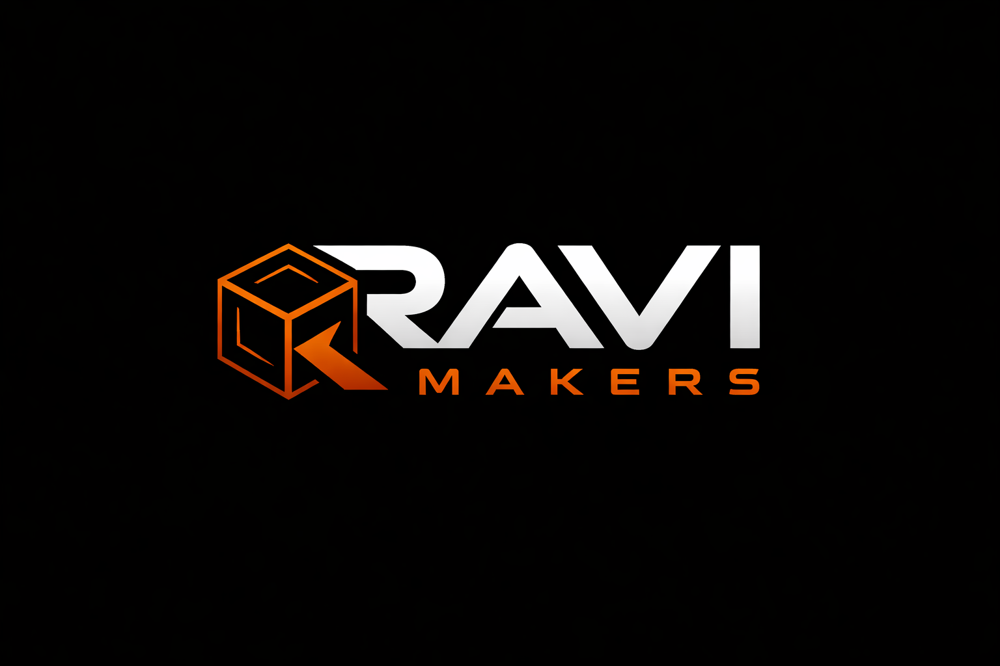

  

  # RAVI MAKERS — Orçamento 3D

  Sistema web para gestão e precificação de serviços de impressão 3D.

## Sobre o projeto

O RAVI MAKERS foi desenvolvido para facilitar a rotina de empresas de impressão 3D. A aplicação analisa arquivos G-code, calcula automaticamente os custos de produção e ajuda a organizar orçamentos, clientes, estoque e impressoras em um único lugar.

## Principais funcionalidades

- análise de arquivos G-code;
- cálculo de material, energia, tempo de máquina, perdas e margem de lucro;
- criação de orçamentos e geração de PDF;
- gestão de clientes, impressoras, filamentos e consumíveis;
- controle e histórico de movimentações do estoque;
- acompanhamento da produção;
- integração com OctoPrint e Moonraker;
- catálogo público e pedidos pelo WhatsApp;
- autenticação e painel administrativo responsivo.

## Tecnologias

Java 21, Spring Boot, Spring Security, PostgreSQL, Thymeleaf, JavaScript, Docker e Render.

## Objetivo

Este projeto demonstra conhecimentos em desenvolvimento full stack, modelagem de regras de negócio, segurança, persistência de dados, testes automatizados e implantação de aplicações web.

> Repositório disponibilizado para demonstração técnica e avaliação de portfólio. Todos os direitos reservados.
